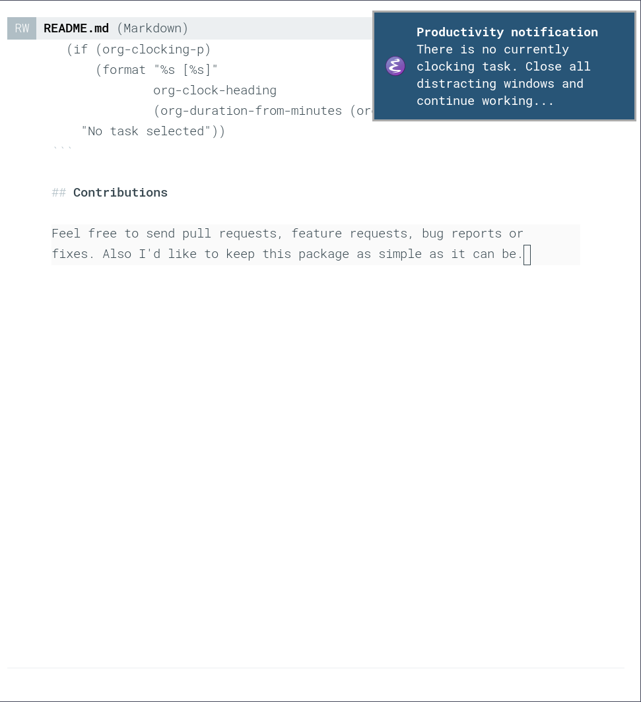

# org-clock-reminder

[](http://www.gnu.org/licenses/gpl-3.0.txt)

In programming, you often have to switch between nested tasks, which makes it quite easy to miss the original goal. This package is designed to remind you of the current task, or its absence at specified intervals.

<div>


</div>

## Installation

This package is not in any emacs package repository yet, so you can't install it with `package.el` or any elpa package manager.

### Install with [straight.el](https://github.com/raxod502/straight.el)

Good news is [straight.el](https://github.com/raxod502/straight.el) can install packages directly from Github. So if you use it, just place code bellow to your emacs configuration file.

```emacs-lisp
(straight-use-package
  '(org-clock-reminder :type git :host github :repo "inickey/org-clock-reminder"))

(require 'org-clock-reminder)
(org-clock-reminder-activate)
```

Or you can use code bellow if you use both [straight.el](https://github.com/raxod502/straight.el) and [use-package](https://github.com/jwiegley/use-package).

```emacs-lisp
(use-package org-clock-reminder
  :straight (:host github :repo "inickey/org-clock-reminder")
  :config (org-clock-reminder-activate))
```

### Manual Installation

When you have cloned this repo to your machine you can load package by adding its location to `load-path` and requiring it.

```emacs-lisp
(let ((org-clock-reminder-path "~/pr/org-clock-reminder"))
  (when (file-directory-p org-clock-reminder-path)
    (add-to-list 'load-path org-clock-reminder-path)
    (require 'org-clock-reminder)
    (org-clock-reminder-activate)))
```
    
Or you can do same thing with [use-package](https://github.com/jwiegley/use-package) if you prefer to use it (only with locally cloned repo):

```lisp
(use-package org-clock-reminder
  :if (file-exists-p "~/pr/org-clock-reminder/org-clock-reminder.el")
  :load-path "~/pr/org-clock-reminder"
  :config (org-clock-reminder-activate))
```

## Activation and deactivation

After you have installed this package you can use `org-clock-reminder-activate` and `org-clock-reminder-deactivate` functions. Actually it's enough to add activation call to your `init.el` file on basic use case.

## Customization

You can customize notification intervals in seconds. By default notifications appears every 10 minutes.

```emacs-lisp
(setq org-clock-reminder-interval 600)
```
    
You can turn on inactivity reminds, which are will be send when there's no current clocking task. By default it's turned off.

```emacs-lisp
(setq org-clock-reminder-remind-inactivity 't)
```

You can also change notification title string and body format string.

The body format string supports customizable formatters (see `org-clock-reminder-formatters`), by default `%c` is the clocked-in time, and `%h` is the current header.

```emacs-lisp
(setq org-clock-reminder-notification-title "Productivity notification"
      org-clock-reminder-format-string "You worked for %c on<br/>%h")
```

If you have turned on inactivity notifications, you can also set inactivity notification text.

```emacs-lisp
(setq org-clock-reminder-empty-text "No task is being clocked. Close all distracting windows and continue working...")
```
    
You can set icons for clocking and inactivity states with the following parameters.

```emacs-lisp
(setq org-clock-reminder-clocking-icon "~/img/clocking.png"
      org-clock-reminder-inactivity-icon "~/img/inactivity.png")
```

Or if you don't want to see the icons on notifications, you can turn them off.

```emacs-lisp
(setq org-clock-reminder-show-icons nil)
```

Additionally, you can customize how your are notified.  By default the `notifications` library is used, but you may set multiple or alternate notifiers using the hook `org-clock-reminder-notifiers`, with each function taking title and message arguments.

## Contributions

Feel free to send pull requests, feature requests, bug reports or fixes. Also I'd like to keep this package as simple as it can be.

## Icons

I am not designer or picture artist at all, so provided icons are found on the Internet. If you have a better idea for mnemonic icons to use, or you have your own icons, please let me know.

Icons made by <a href="https://www.flaticon.com/authors/freepik" title="Freepik">Freepik</a> from <a href="https://www.flaticon.com/" title="Flaticon">www.flaticon.com</a>
